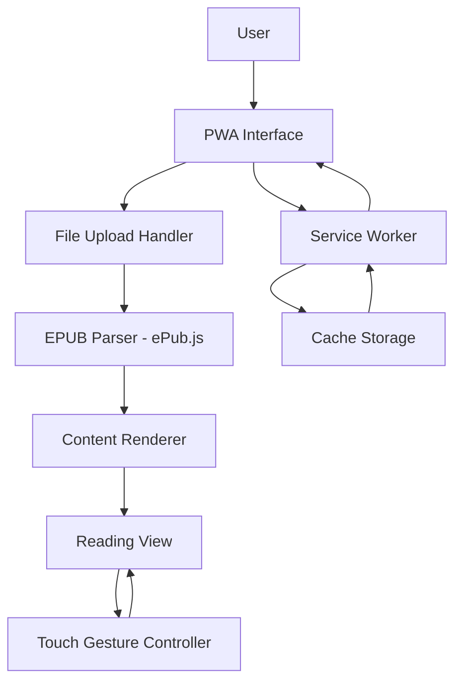
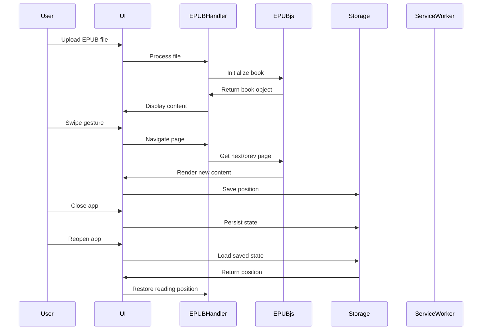

# EPUB Reader PWA - Architecture Documentation

## Project Overview
A Progressive Web App (PWA) for reading EPUB files, optimized for iPad with touch-friendly navigation and offline capability.

## Technology Stack

### Core Technologies
- **HTML5**: Semantic markup for structure
- **CSS3**: Modern styling with CSS Grid/Flexbox for responsive layouts
- **JavaScript (ES6+)**: Modern JavaScript with modules
- **PWA APIs**: Service Worker, Web App Manifest, Cache API

### Key Library
- **ePub.js v0.3+** (https://github.com/futurepress/epub.js)
  - Lightweight (~100KB minified)
  - Supports EPUB 2 and EPUB 3 formats
  - Built-in rendering and navigation
  - Actively maintained
  - No jQuery dependency
  - CDN available via jsDelivr

## Architecture Overview



## Application Architecture

### Layer Structure

#### 1. Presentation Layer
- **Purpose**: User interface and interaction handling
- **Components**:
  - File upload interface
  - Reading view container
  - Navigation controls overlay
  - Progress indicator
  - Loading states

#### 2. Business Logic Layer
- **Purpose**: Core application logic
- **Components**:
  - EPUB processing module
  - Navigation controller
  - Touch gesture handler
  - State management
  - Progress tracking

#### 3. Data Layer
- **Purpose**: Data storage and retrieval
- **Components**:
  - File handling via File API
  - Reading position persistence (localStorage)
  - Cache management via Service Worker

## File Structure

```
epub-reader-pwa/
│
├── index.html                 # Main HTML entry point
├── manifest.json             # PWA manifest configuration
├── sw.js                     # Service Worker for offline functionality
│
├── css/
│   ├── main.css             # Core application styles
│   ├── reader.css           # Reader-specific styles
│   └── responsive.css       # iPad and responsive styles
│
├── js/
│   ├── app.js               # Main application initialization
│   ├── epub-handler.js      # EPUB parsing and management
│   ├── reader.js            # Reading view controller
│   ├── navigation.js        # Navigation and gestures
│   └── storage.js           # State persistence utilities
│
├── assets/
│   ├── icons/               # PWA icons (192x192, 512x512)
│   │   ├── icon-192.png
│   │   ├── icon-512.png
│   │   └── icon-maskable.png
│   └── fonts/               # Optional web fonts (if needed)
│
└── README.md                # Project documentation
```

## Component Design

### 1. File Upload Handler (`js/app.js` + `js/epub-handler.js`)
**Responsibilities**:
- Handle file input selection
- Validate EPUB file format
- Initialize ePub.js with selected file
- Display loading states

**Key APIs**:
- File API for file reading
- FileReader for binary data processing
- ePub.js Book constructor

### 2. EPUB Parser (`js/epub-handler.js`)
**Responsibilities**:
- Parse EPUB structure using ePub.js
- Extract metadata (title, author, cover)
- Generate table of contents
- Manage book navigation spine

**Implementation**:
```javascript
// Pseudo-code structure
class EPUBHandler {
  constructor()
  loadBook(file)
  getMetadata()
  getTOC()
  renderToElement(container)
}
```

### 3. Reader View (`js/reader.js`)
**Responsibilities**:
- Render EPUB content
- Handle page layout and styling
- Manage reading progress
- Display current chapter/page

**Key Features**:
- Responsive container that adapts to iPad viewport
- Clean, distraction-free reading interface
- Visual feedback for navigation

### 4. Navigation Controller (`js/navigation.js`)
**Responsibilities**:
- Handle swipe gestures (left/right)
- Handle tap zones (left edge = previous, right edge = next, center = menu)
- Manage page transitions
- Update progress indicator

**Touch Event Handling**:
- `touchstart`, `touchmove`, `touchend` for swipe detection
- Click event delegation for tap zones
- Prevent default behaviors that interfere with reading

### 5. Storage Manager (`js/storage.js`)
**Responsibilities**:
- Save current reading position
- Persist user preferences (if added later)
- Retrieve last read position on reload

**Storage Strategy**:
- localStorage for reading position (book identifier + location)
- Key format: `epub_progress_{bookHash}`

## PWA Configuration

### manifest.json Specification

```json
{
  "name": "EPUB Reader",
  "short_name": "Reader",
  "description": "Read EPUB books on your iPad",
  "start_url": "/",
  "display": "standalone",
  "orientation": "any",
  "background_color": "#ffffff",
  "theme_color": "#4CAF50",
  "icons": [
    {
      "src": "/assets/icons/icon-192.png",
      "sizes": "192x192",
      "type": "image/png",
      "purpose": "any"
    },
    {
      "src": "/assets/icons/icon-512.png",
      "sizes": "512x512",
      "type": "image/png",
      "purpose": "any"
    },
    {
      "src": "/assets/icons/icon-maskable.png",
      "sizes": "512x512",
      "type": "image/png",
      "purpose": "maskable"
    }
  ]
}
```

**Key Settings**:
- `display: standalone` - Hides browser chrome for app-like experience
- `orientation: any` - Supports both portrait and landscape
- Multiple icon sizes for various iOS display contexts

### Service Worker Strategy (`sw.js`)

**Caching Strategy**:
1. **Cache First** for static assets:
   - HTML, CSS, JavaScript files
   - Icons and fonts
   - ePub.js library from CDN

2. **Network First** for EPUB files:
   - User-uploaded files aren't cached (privacy consideration)
   - Allow fresh content on each load

**Implementation Phases**:
```javascript
// Pseudo-code structure
self.addEventListener('install', event => {
  // Cache static assets on install
});

self.addEventListener('fetch', event => {
  // Serve from cache, fallback to network
});

self.addEventListener('activate', event => {
  // Clean up old caches
});
```

**Cache Versioning**:
- Use version-based cache names: `epub-reader-v1`
- Implement cache cleanup on activation

## iPad-Specific Optimizations

### 1. Viewport Configuration
```html
<meta name="viewport" content="width=device-width, initial-scale=1.0, 
  maximum-scale=1.0, user-scalable=no, viewport-fit=cover">
```

**Key Settings**:
- `user-scalable=no` - Prevents accidental pinch-zoom during reading
- `viewport-fit=cover` - Ensures content extends to screen edges
- `maximum-scale=1.0` - Locks zoom level for consistent experience

### 2. Apple-Specific Meta Tags
```html
<meta name="apple-mobile-web-app-capable" content="yes">
<meta name="apple-mobile-web-app-status-bar-style" content="black-translucent">
<link rel="apple-touch-icon" href="/assets/icons/icon-192.png">
```

**Purpose**:
- Enables full-screen mode when added to home screen
- Configures status bar appearance
- Provides icon for home screen

### 3. Touch Gesture Implementation

**Swipe Detection**:
```javascript
// Pseudo-code
let touchStartX = 0;
let touchEndX = 0;

element.addEventListener('touchstart', e => {
  touchStartX = e.changedTouches[0].screenX;
});

element.addEventListener('touchend', e => {
  touchEndX = e.changedTouches[0].screenX;
  handleSwipe();
});

function handleSwipe() {
  if (touchEndX < touchStartX - 50) {
    // Swipe left - next page
  }
  if (touchEndX > touchStartX + 50) {
    // Swipe right - previous page
  }
}
```

**Tap Zones**:
- Left 30% of screen = previous page
- Right 30% of screen = next page
- Center 40% = toggle menu/settings (future feature)

### 4. Responsive Design Considerations

**Breakpoints**:
- iPad Portrait: 768px - 1024px width
- iPad Landscape: 1024px+ width
- Adjust font sizes and margins accordingly

**Typography**:
- Base font size: 18px (comfortable for reading)
- Line height: 1.6-1.8 (optimal readability)
- Max content width: 700px (prevents overly long lines)

### 5. Performance Optimizations

**CSS**:
- Use `will-change: transform` for smooth page transitions
- Enable hardware acceleration with `transform: translateZ(0)`
- Minimize reflows during gesture handling

**JavaScript**:
- Debounce touch events to reduce processing
- Use passive event listeners where possible
- Lazy load non-critical features

### 6. Safari-Specific Considerations

**Prevent Rubber-Band Scrolling**:
```css
body {
  overscroll-behavior: none;
  -webkit-overflow-scrolling: touch;
}
```

**Hide Tap Highlight**:
```css
* {
  -webkit-tap-highlight-color: transparent;
}
```

## Data Flow



## User Experience Flow

### Initial Load
1. User opens PWA
2. Service Worker activates (if installed)
3. Display file upload interface
4. Prompt to select EPUB file

### Reading Session
1. User selects EPUB file
2. Show loading indicator
3. Parse and render first page
4. Enable touch gestures
5. User navigates via swipes or tap zones
6. Auto-save progress periodically

### Offline Capability
1. User closes app while reading
2. Service Worker caches current position
3. User reopens app (offline)
4. App loads from cache
5. Reading continues from saved position

## Security Considerations

### File Handling
- EPUB files processed entirely client-side
- No server upload or storage
- Files remain on user's device only

### Data Privacy
- Reading positions stored locally only
- No analytics or tracking
- No external data transmission

### Content Security Policy (CSP)
```html
<meta http-equiv="Content-Security-Policy" 
  content="default-src 'self'; 
  script-src 'self' https://cdn.jsdelivr.net; 
  style-src 'self' 'unsafe-inline';">
```

## Performance Targets

### Loading Time
- Initial page load: < 2 seconds
- EPUB parsing: < 3 seconds for typical book
- Page navigation: < 300ms transition

### Memory Usage
- Target: < 100MB for typical EPUB
- Handle books up to 50MB file size
- Efficient memory cleanup on book change

### Battery Efficiency
- Minimize wake locks
- Optimize rendering for fewer repaints
- Use CSS animations over JavaScript where possible

## Error Handling

### File Upload Errors
- Invalid file format
- File too large (> 50MB)
- Corrupted EPUB structure

### Reading Errors
- Failed to parse EPUB metadata
- Missing or corrupted content chapters
- Image loading failures

### Storage Errors
- localStorage quota exceeded
- Failed to save reading position

**Strategy**:
- Display user-friendly error messages
- Provide fallback options
- Log errors to console for debugging

## Testing Strategy

### Browser Testing
- Safari on iPad (primary target)
- iOS 14+ compatibility
- Portrait and landscape orientations

### Functional Testing
- File upload workflow
- Page navigation (swipes and taps)
- Progress persistence
- Offline mode functionality

### Performance Testing
- EPUB parsing time for various file sizes
- Memory usage monitoring
- Smooth gesture response (60fps target)

## Future Enhancement Considerations

While these are NOT part of the MVP, document for future reference:

### Reading Features
- Bookmarking capability
- Text highlighting
- Font size/style customization
- Night mode/themes
- Search within book

### Library Management
- Multiple book library
- Recent books list
- Reading history
- Book covers display

### Social Features
- Reading progress sharing
- Notes and annotations
- Export highlights

## Implementation Phases

### Phase 1: Core Setup ✓
- [x] Define architecture
- [ ] Create file structure
- [ ] Set up basic HTML/CSS
- [ ] Configure PWA manifest
- [ ] Implement basic service worker

### Phase 2: EPUB Integration
- [ ] Integrate ePub.js library
- [ ] Implement file upload handler
- [ ] Build EPUB parser wrapper
- [ ] Render content in reading view

### Phase 3: Navigation
- [ ] Implement touch gesture detection
- [ ] Add tap zone navigation
- [ ] Create progress indicator
- [ ] Add page transition animations

### Phase 4: Persistence
- [ ] Implement localStorage for progress
- [ ] Save/restore reading position
- [ ] Handle app lifecycle events

### Phase 5: Polish & Testing
- [ ] iPad-specific optimizations
- [ ] Performance tuning
- [ ] Cross-browser testing
- [ ] Error handling refinement

## Development Notes

### Tools Required
- Modern code editor (VS Code recommended)
- Local web server (Live Server extension or Python's `http.server`)
- iPad or iPad simulator for testing
- Browser DevTools for debugging

### Development Workflow
1. Set up local development environment
2. Implement features module by module
3. Test on local server
4. Test on actual iPad device
5. Deploy to hosting service (GitHub Pages, Netlify, etc.)

### Debugging Tips
- Use Safari Web Inspector to debug on iPad
- Enable console logging for gesture events
- Monitor Service Worker status in DevTools
- Check Cache Storage contents

## Deployment Considerations

### Hosting Requirements
- Static file hosting (no server-side processing needed)
- HTTPS required (PWA requirement)
- Custom domain optional but recommended

### Recommended Platforms
- GitHub Pages (free, HTTPS included)
- Netlify (free tier, automatic deployments)
- Vercel (free tier, optimized for static sites)

### Pre-Deployment Checklist
- [ ] All PWA icons generated and optimized
- [ ] manifest.json properly configured
- [ ] Service Worker tested in production mode
- [ ] CSP headers configured
- [ ] Performance tested on target device
- [ ] Error handling verified

---

## Summary

This architecture provides a solid foundation for an MVP EPUB reader PWA optimized for iPad. The design emphasizes:

1. **Simplicity**: Minimal dependencies, clear structure
2. **Performance**: Fast loading, smooth interactions
3. **User Experience**: Touch-friendly, intuitive navigation
4. **Offline Capability**: Full PWA functionality
5. **Maintainability**: Modular code, clear separation of concerns

The chosen stack (ePub.js + vanilla JS) keeps the application lightweight while providing robust EPUB support. The architecture is extensible for future enhancements while remaining focused on core MVP functionality.